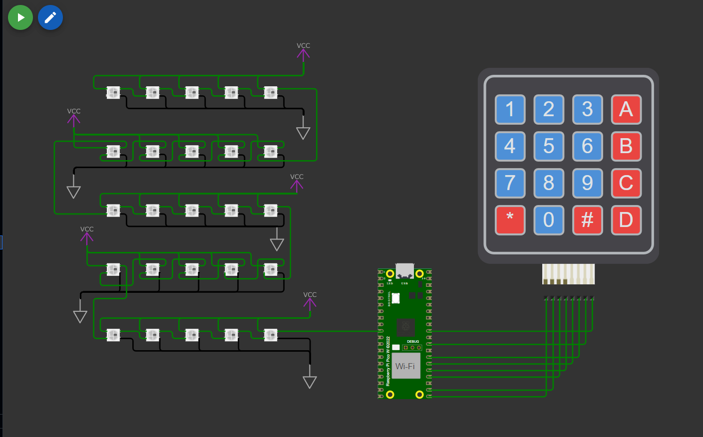

## Tarefa Embarcatech: Animações em matriz LED 5x5

Atividade em grupo com o objetivo de realizar o acionamento dos 25 LEDs, de forma a criar diferentes tipos de animações de curta duração.

# Modelo das pastas

```
SRC  
├── Matriz_Led_PIO.c (arquivo principal a ser rodado)  
└── Util  
    ├── drawing.c (local de produção dos arrays de desenho)  
    ├── drawing.h  
    ├── keypad.c (responsável pela coordenação do keypad)  
    ├── keypad.h  
    ├── matrizLedControl.c (responsável pelo controle da matriz de led 5x5)  
    ├── matrizLedControl.h  
    ├── definitions.h (guarda e salva Definições usadas)  
    └── ledStruct.h (salva o struct utilizado para o RGB) 
``` 

# Funções

Comandos do keypad:
  
[0-9]) Uma animação feita cada uma por um membro da equipe. utilizando 5 frames. A X frames por segundo.
A) Desliga todos os LEDS  
B) Liga todos os LEDS na cor azul. Intensidade 100%.  
C) Liga todos os LEDS na cor vermelha. Intensidade 80%.  
D) Liga todos os LEDS na cor verde. Intensidade 50%.  
\#) Liga todos os LEDS na cor branca. Intensidade 20%. 

# Como compilar

1) Instale a extensão Raspeberry PI PICO do vscode
2) Compile o código clicando em compile project na aba da extensão, ou rodando o arquivo cmakelist manualmente.


# Como rodar

1) Primeiramente compile o código para que a biblioteca ws2818b.pio seja adicionada ao sistema.
2) Instale a extensão Wokwi do vscode e confira se esta esta corretamente configurada (consulte o site https://docs.wokwi.com/pt-BR/vscode/getting-started em caso de dúvidas)
3) Abra o arquivo diagram e click no botão de play



# Video do funcionamento